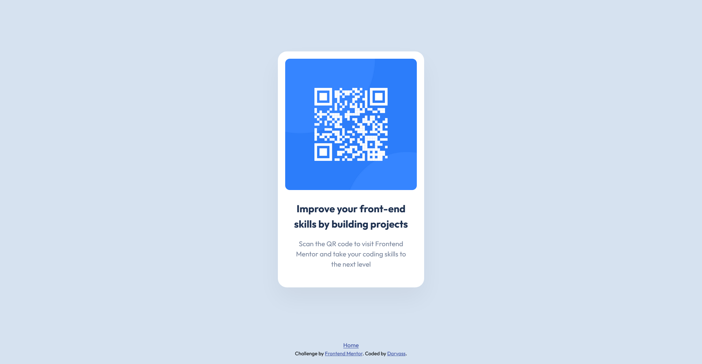

# Frontend Mentor - QR code component solution

This is a solution to the [QR code component challenge on Frontend Mentor](https://www.frontendmentor.io/challenges/qr-code-component-iux_sIO_H). Frontend Mentor challenges help you improve your coding skills by building realistic projects. 

## Table of contents

- [Frontend Mentor - QR code component solution](#frontend-mentor---qr-code-component-solution)
  - [Table of contents](#table-of-contents)
  - [Overview](#overview)
    - [Screenshot](#screenshot)
    - [Links](#links)
  - [My process](#my-process)
    - [Built with](#built-with)
    - [Continued development](#continued-development)
  - [Author](#author)
  - [Acknowledgments](#acknowledgments)

**Note: Delete this note and update the table of contents based on what sections you keep.**

## Overview

### Screenshot

### Links

- [Solution](https://www.frontendmentor.io/solutions/react-qr-code-card-RAfOTfAtcZ)
- [Live Site](https://darvass69.github.io/Frontend-mentor-challenges/#/QR-code-component)

## My process

### Built with

- Semantic HTML5 markup
- Sass/scss
- Flexbox
- [React](https://reactjs.org/) - JS library
<!-- - [Styled Components](https://styled-components.com/) - For styles 
  ? Could be really helpful
-->

### Continued development

I want to find a way to have the page look good on mobile browsers. Here are what I still need to fix:

+ Make the address bar collapse on mobile when the user tries to scroll the page. At the moment, a big portion of the screen is taken by it and it would be useful to find a fix.
+ Make the card adapt better to really small mobile screens.

I also want to improve the accessibility with things like aria roles and a more semantic html.

## Author

- Frontend Mentor - [@Darvass69](https://www.frontendmentor.io/profile/Darvass69)

## Acknowledgments

I looked at other solutions to improve my solution. I used [this solution]() by 

This is where you can give a hat tip to anyone who helped you out on this project. Perhaps you worked in a team or got some inspiration from someone else's solution. This is the perfect place to give them some credit.

**Note: Delete this note and edit this section's content as necessary. If you completed this challenge by yourself, feel free to delete this section entirely.**
